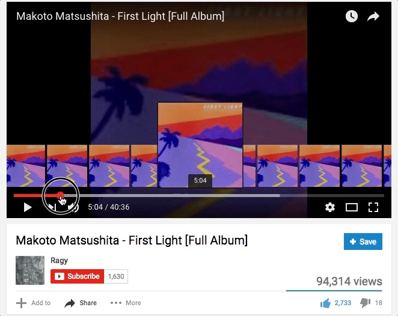
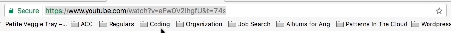
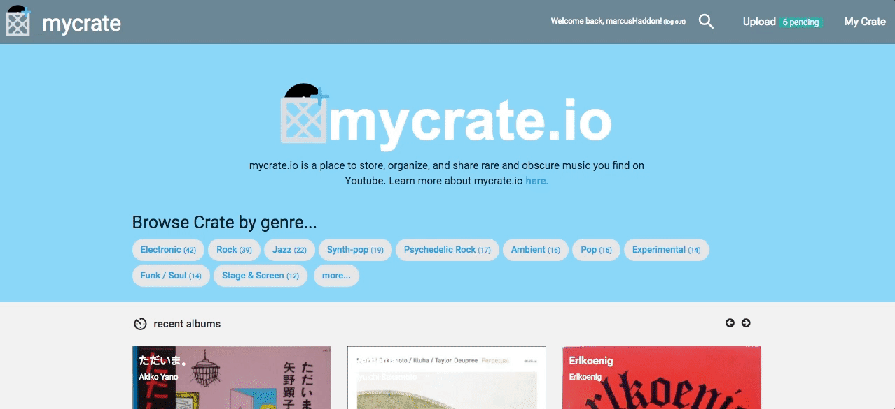
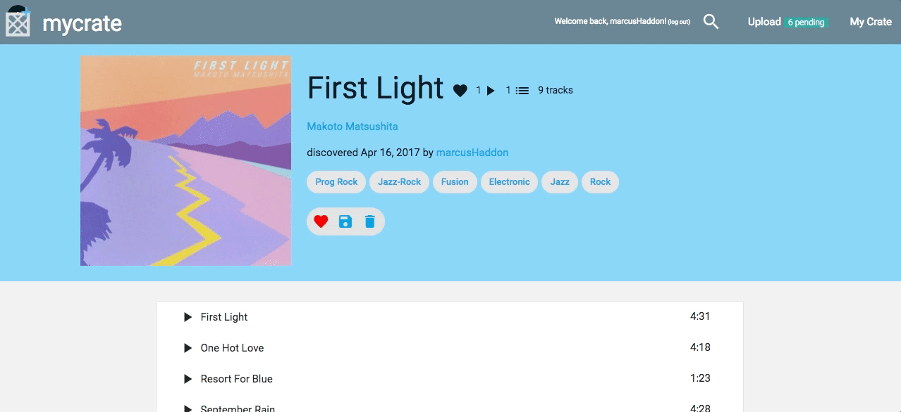
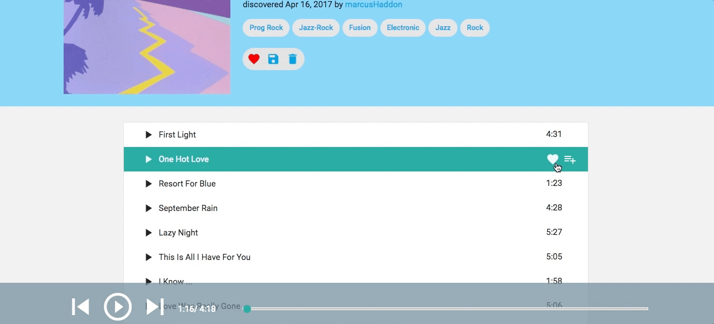
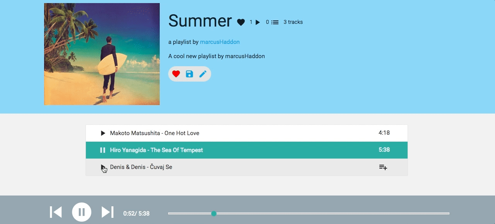

# Do you enjoy scouring the internet for eclectic, obscure music?
If so, I bet you have at least one bookmarks folder that looks like this...

... and each one is a link to something like this:

>If you feel like listening to the whole album start to finish, then great! But if you want to hear that *one* song, it's a pain. And if you wanted to curate a playlist of the deepest cuts from all of your Youtube digging gems? *Forget about it...*

# OR just grab that Youtube URL...

  

# Head on over to [mycrate.io](https://www.mycrate.io)...

  

# ...and put it into our "Upload" section.

  

# Provide us with the Artist + Album name of the video you are uploading.

  

# mycrate.io will search Discogs for the release.
## Let us know which result is correct and...

  

# Viola! Skip to the song you want to listen to!!!

  

# Or add it to a playlist!

  

  

# All the albums, artists, tracks, and playlists in your "crate" are easily accessible...

  

# Everything uploaded to mycrate.io is available for discovery by all users.

  

# You can browse mycrate.io by genre...

  
 
# ...discover music through Artist profiles (automatically imported from Discogs)...

 
   
 
# ...or see what music a given user has uploaded / listened to / added to their crate.

 
   
 
There are **[lots of features](https://gist.github.com/marcushaddon/b14a5f9d195c08122dacd0739d9296f8)** planned for mycrate.io. **[Give it a try](https://www.mycrate.io)** and let us know if you have any suggestions!
